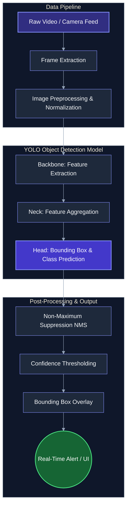

# 🛣️ Real-Time Pothole Detection using YOLO

<div align="center">
  
  
  
  
  
</div>

<br/>

> **An advanced, deep learning-based computer vision system designed to detect and localize potholes on roads in real-time.** 
> Seamlessly integrable with Advanced Driver Assistance Systems (ADAS) and smart city infrastructure to prevent accidents, minimize vehicle damage, and enhance overall road safety.

---

## 📑 Table of Contents
- [Motivation](#-motivation)
- [System Architecture](#-system-architecture)
- [Key Features](#-key-features)
- [Technology Stack](#-technology-stack)
- [Prerequisites](#-prerequisites)
- [Installation](#-installation)
- [Usage Guide](#-usage-guide)
- [Project Structure](#-project-structure)
- [Model Training & Evaluation](#-model-training--evaluation)
- [Future Roadmap](#-future-roadmap)
- [Contributing](#-contributing)
- [License](#-license)

---

## 🎯 Motivation

Poor road conditions and undetected potholes contribute to millions of dollars in vehicle damage and pose severe safety risks to drivers worldwide. Traditional road monitoring relies on manual inspection, which is slow, expensive, and inefficient. This project automates road hazard detection using state-of-the-art **YOLO (You Only Look Once)** object detection, enabling real-time alerts for drivers and automated reporting for municipal maintenance systems.

---

## 🏗️ System Architecture

The following flowchart illustrates the complete pipeline, from data ingestion to real-time inference and alerting. The diagram is styled with a high-contrast dark theme for optimal visibility on GitHub.



### Pipeline Breakdown:
1. **Data Pipeline:** Captures live video feeds (e.g., from a dashcam), extracts individual frames, and resizes them to the model's expected input resolution.
2. **YOLO Inference:** The preprocessed frame is passed through the YOLO network, which extracts hierarchical features and predicts bounding boxes for potholes.
3. **Post-Processing:** Applies Non-Maximum Suppression (NMS) to filter out overlapping predictions, leaving only the most confident bounding boxes.
4. **Output:** The system overlays the bounding boxes onto the original frame and triggers an alert if a pothole is detected in the vehicle's path.

---

## ✨ Key Features

- **⚡ Real-Time Processing:** Optimized for high FPS (Frames Per Second) inference, making it highly suitable for live dashcam feeds.
- **🎯 High Precision & Recall:** Utilizes the robust YOLO architecture to minimize false positives while ensuring critical road hazards are detected.
- **🪶 Edge-Device Ready:** Lightweight model weights allow for deployment on edge AI hardware like Raspberry Pi, NVIDIA Jetson Nano, or mobile devices.
- **🔌 Plug-and-Play API:** Simple Python scripts for seamless integration with existing ADAS or smart city monitoring software.

---

## 💻 Technology Stack

- **Deep Learning Framework:** PyTorch
- **Object Detection Model:** YOLOv8 (Ultralytics)
- **Computer Vision:** OpenCV
- **Data Manipulation:** NumPy, Pandas
- **Visualization:** Matplotlib, Seaborn

---

## 🛠️ Prerequisites

Ensure your development environment meets the following requirements:
- **OS:** Linux (Ubuntu 20.04+), Windows 10/11, or macOS
- **Python:** Version 3.8 or higher
- **Hardware:** A CUDA-compatible NVIDIA GPU is highly recommended for real-time inference (e.g., GTX 1660 or better).

---

## 🚀 Installation

1. **Clone the repository:**
   ```bash
   git clone https://github.com/Rupeshbhardwaj002/Real_time_pothole_detection_using_YOLO.git
   cd Real_time_pothole_detection_using_YOLO
   ```

2. **Create and activate a virtual environment (Recommended):**
   ```bash
   # On Linux/macOS
   python3 -m venv venv
   source venv/bin/activate

   # On Windows
   python -m venv venv
   venv\Scripts\activate
   ```

3. **Install the required dependencies:**
   ```bash
   pip install --upgrade pip
   pip install -r requirements.txt
   ```

---

## 🎮 Usage Guide

### 1. Running Inference on a Pre-Recorded Video
To test the detection model on a sample video file:

```bash
python detect.py --source path/to/your/test_video.mp4 --weights runs/train/weights/best.pt --conf 0.5
```

### 2. Running Inference on a Live Camera Feed
To use your webcam or a connected USB dashcam:

```bash
python detect.py --source 0 --weights runs/train/weights/best.pt --conf 0.5
```

**CLI Arguments:**
- `--source`: Path to the video file, image, or `0` for the default webcam.
- `--weights`: Path to the trained YOLO weights file (e.g., `best.pt`).
- `--conf`: Confidence threshold for detections (default is `0.5`).
- `--save`: Add this flag to save the output video with bounding boxes.

---

## 📂 Project Structure

```text
Real_time_pothole_detection_using_YOLO/
│
├── datasets/                 # Training and validation image datasets
├── runs/                     # Model training logs and saved weights
│   └── train/
│       └── weights/
│           ├── best.pt       # Best performing model weights
│           └── last.pt       # Last epoch weights
│
├── detect.py                 # Script for running inference
├── train.py                  # Script for training the YOLO model
├── data.yaml                 # Dataset configuration file
├── requirements.txt          # Python dependencies
└── README.md                 # Project documentation
```

---

## 📊 Model Training & Evaluation

### Custom Training
The model was trained on a custom dataset of road images containing potholes under various lighting and weather conditions. To train the model from scratch on your own dataset:

1. Organize your dataset in the standard YOLO format (images and corresponding `.txt` label files).
2. Update the `data.yaml` file with your dataset paths and class names.
3. Execute the training script:
   ```bash
   yolo task=detect mode=train model=yolov8n.pt data=data.yaml epochs=100 imgsz=640 batch=16 device=0
   ```

### Performance Metrics
*(Note: Replace with your actual metrics)*
- **mAP@0.5:** ~0.89
- **Precision:** ~0.85
- **Recall:** ~0.82
- **Inference Speed:** ~12ms per frame on NVIDIA RTX 3060

---

## 🔮 Future Roadmap

- [ ] **Night Vision & Adverse Weather:** Improve detection accuracy during night time, heavy rain, or fog using thermal imaging or enhanced augmented datasets.
- [ ] **Severity Estimation:** Implement depth estimation to classify potholes based on severity (Low, Medium, High) to prioritize road maintenance.
- [ ] **Mobile Application:** Develop an Android/iOS app to crowd-source pothole locations using smartphone cameras and GPS tagging.
- [ ] **Web Dashboard:** Build a React-based dashboard for city planners to view a heatmap of detected potholes.

---

## 🤝 Contributing

Contributions make the open-source community an amazing place to learn, inspire, and create. Any contributions you make are **greatly appreciated**.

1. Fork the Project
2. Create your Feature Branch (`git checkout -b feature/AmazingFeature`)
3. Commit your Changes (`git commit -m 'Add some AmazingFeature'`)
4. Push to the Branch (`git push origin feature/AmazingFeature`)
5. Open a Pull Request

---

## 📄 License

This project is distributed under the MIT License. See the `LICENSE` file for more information.

---
<div align="center">
  <b>If you find this project useful, please consider giving it a ⭐ on GitHub!</b><br>
  Made with ❤️ by <a href="https://github.com/Rupeshbhardwaj002">Rupesh Bhardwaj</a>
</div>

