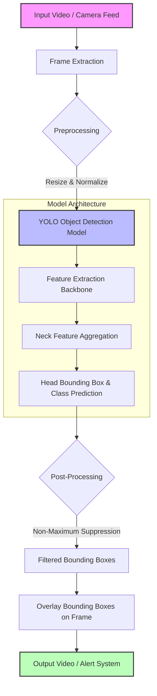

# 🛣️ Real-Time Pothole Detection using YOLO

[](https://opensource.org/licenses/MIT)
[](https://www.python.org/downloads/)
[](https://github.com/ultralytics/ultralytics)
[](https://opencv.org/)

> **A deep learning-based computer vision project that identifies potholes on the road in real-time.** 
> These types of models can be integrated with today's smart vehicles and Advanced Driver Assistance Systems (ADAS) to prevent accidents, minimize vehicle damage, and significantly increase overall road safety.

---

## 📑 Table of Contents
- [Overview](#-overview)
- [Architecture & Flow](#-architecture--flow)
- [Features](#-features)
- [Prerequisites](#-prerequisites)
- [Installation](#-installation)
- [Usage](#-usage)
- [Dataset & Training](#-dataset--training)
- [Results](#-results)
- [Future Scope](#-future-scope)
- [Contributing](#-contributing)
- [License](#-license)

---

## 📖 Overview

Potholes are a major cause of road accidents and vehicle damage worldwide. This project leverages the state-of-the-art **YOLO (You Only Look Once)** object detection framework to detect potholes in real-time from video feeds or dashcam footage. By providing immediate visual feedback and bounding boxes around detected road hazards, this system serves as a foundational component for autonomous driving and smart city infrastructure monitoring.

---

## 🏗️ Architecture & Flow

The following diagram illustrates the end-to-end pipeline of the pothole detection system:



1. **Input:** Video stream from a dashboard camera or pre-recorded video.
2. **Preprocessing:** Frames are extracted, resized, and normalized to match the YOLO model's input requirements.
3. **Inference:** The YOLO model processes the frame, extracting features and predicting bounding boxes for potential potholes.
4. **Post-Processing:** Non-Maximum Suppression (NMS) is applied to remove redundant overlapping bounding boxes.
5. **Output:** The final frame is rendered with bounding boxes and confidence scores, which can trigger an alert in a smart vehicle system.

---

## ✨ Features

- **Real-Time Detection:** Optimized for high FPS processing suitable for live dashcam feeds.
- **High Accuracy:** Utilizes the robust YOLO architecture for precise localization of potholes of various sizes.
- **Lightweight:** Can be deployed on edge devices (e.g., Raspberry Pi, Jetson Nano) with optimized model weights.
- **Easy Integration:** Simple Python API for integrating with existing ADAS or smart city monitoring software.

---

## 🛠️ Prerequisites

Ensure you have the following installed on your system:
- Python 3.8 or higher
- Git
- A CUDA-compatible GPU (Highly recommended for real-time inference)

---

## 🚀 Installation

1. **Clone the repository:**
   ```bash
   git clone https://github.com/Rupeshbhardwaj002/Real_time_pothole_detection_using_YOLO.git
   cd Real_time_pothole_detection_using_YOLO
   ```

2. **Create a virtual environment (Optional but recommended):**
   ```bash
   python -m venv venv
   source venv/bin/activate  # On Windows use `venv\Scripts\activate`
   ```

3. **Install the required dependencies:**
   ```bash
   pip install -r requirements.txt
   ```

---

## 💻 Usage

### Running Inference on a Video
To run the detection model on a sample video file:

```bash
python detect.py --source path/to/your/video.mp4 --weights best.pt --conf 0.5
```

### Running Inference on a Live Camera Feed
To use your webcam or a connected dashcam:

```bash
python detect.py --source 0 --weights best.pt --conf 0.5
```

**Arguments:**
- `--source`: Path to the video file or `0` for webcam.
- `--weights`: Path to the trained YOLO weights file (`best.pt`).
- `--conf`: Confidence threshold for detections (default is `0.5`).

---

## 📊 Dataset & Training

The model was trained on a custom dataset of road images containing potholes under various lighting and weather conditions. 

To train the model from scratch on your own dataset:
1. Organize your dataset in the YOLO format (images and `.txt` label files).
2. Update the `data.yaml` file with your dataset paths and class names.
3. Run the training script:
   ```bash
   yolo task=detect mode=train model=yolov8n.pt data=data.yaml epochs=100 imgsz=640
   ```

---

## 📈 Results

The model achieves high precision and recall, effectively minimizing false positives while ensuring that critical road hazards are not missed. 

*(Add screenshots or GIFs of your model detecting potholes here)*
> ``

---

## 🔮 Future Scope

- **Night Vision & Bad Weather:** Improve detection accuracy during night time, heavy rain, or fog using thermal imaging or enhanced datasets.
- **Severity Estimation:** Classify potholes based on depth and severity to prioritize road maintenance.
- **Mobile Application:** Develop an Android/iOS app to crowd-source pothole locations using smartphone cameras.

---

## 🤝 Contributing

Contributions are welcome! If you have ideas for improvements or find any bugs, please follow these steps:
1. Fork the repository.
2. Create a new branch (`git checkout -b feature/AmazingFeature`).
3. Commit your changes (`git commit -m 'Add some AmazingFeature'`).
4. Push to the branch (`git push origin feature/AmazingFeature`).
5. Open a Pull Request.

---

## 📄 License

Distributed under the MIT License. See `LICENSE` for more information.

---
*If you find this project useful, please consider giving it a ⭐ on GitHub!*
